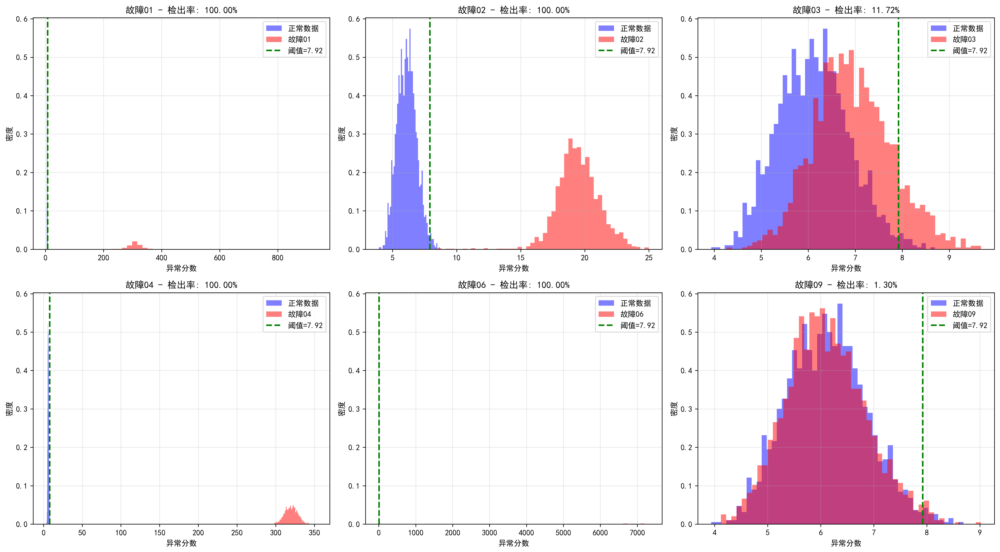
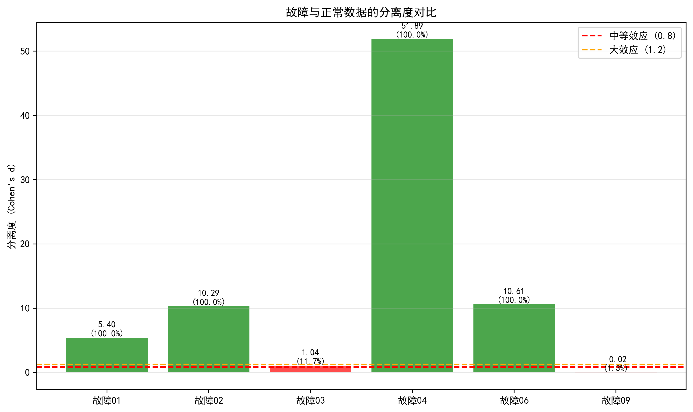

<div align="center">

# 🏭 FGAN-Industrial-Fault-Detection

### Unsupervised industrial fault detection with FBGAN.

A feature-based bidirectional GAN that detects faults in the Tennessee Eastman Process — trained on normal data only.

[](LICENSE)
[](https://www.python.org/)
[](https://pytorch.org/)
[](https://scikit-learn.org/)

</div>

---

**FGAN-Industrial-Fault-Detection** implements **FBGAN** — a feature-based bidirectional generative adversarial network — for **unsupervised industrial fault detection** on the **Tennessee Eastman Process** dataset. It needs only normal-operation data for training, yet achieves **1.30% false alarm rate** and **76.2% average detection rate** across 21 fault types (12 detected at 100%).

> [!NOTE]
> 中文项目：基于双向生成对抗网络（FBGAN）的无监督工业过程故障检测——TEP 数据集，仅用正常数据训练，误报率 1.30%。

---

## Why FBGAN

| Method | FAR | Avg. FDR | Notes |
|--------|-----|----------|-------|
| **FBGAN** | **1.30%** | **76.2%** | unsupervised, low false alarm, high detection |
| Autoencoder | 3–6% | 70–80% | nonlinear but high false alarms |
| PCA / DPCA | 2–5% | 60–70% | simple but linear-assumption bound |

**Key idea** — a bidirectional encoder/decoder maps data to a compact 13-dim feature space and back, with **two discriminators** (data-space and feature-space) and a **cycle-consistency loss**. Reconstruction errors feed an adaptive KDE-based threshold, so no fault labels are needed.

---

## Features

- **Unsupervised** — trains on normal data only; no fault labels required.
- **Bidirectional GAN** — dual discriminators + cycle-consistency for robust reconstruction.
- **Adaptive threshold** — KDE-based score threshold auto-adapts to the data distribution.
- **21-fault coverage** — TEP faults d01–d21 with per-fault test results and visualizations.
- **Deployable** — pretrained models (`models/*.pth`) and per-fault result outputs included.

---

## Quickstart

```bash
git clone https://github.com/Windyhhh/FGAN-Industrial-Fault-Detection.git
cd FGAN-Industrial-Fault-Detection

pip install -r requirements.txt

# run detection on the TEP dataset
python src/fault_detection1.py
```

Pretrained weights live in `models/` (`complete_model.pth`, checkpoints, `scaler.pkl`); per-fault scores and plots are in `results/fault_XX/`.

---

## Project Structure

```
FGAN-Industrial-Fault-Detection/
├── src/
│   ├── FBGAN.py              # FBGAN model
│   ├── FENETFIL.py           # feature net / filtering
│   ├── fault_detection1.py   # detection entry
│   └── config.py             # config
├── models/                   # pretrained weights + scaler
├── data/                     # TEP normal + fault CSVs (d00–d21)
├── results/                  # per-fault scores, plots, summaries
└── docs/                     # RESULTS, threshold explanation
```

---


## Results

<div align="center">
  
  
</div>

---
## License

MIT — free to use, modify and distribute.
