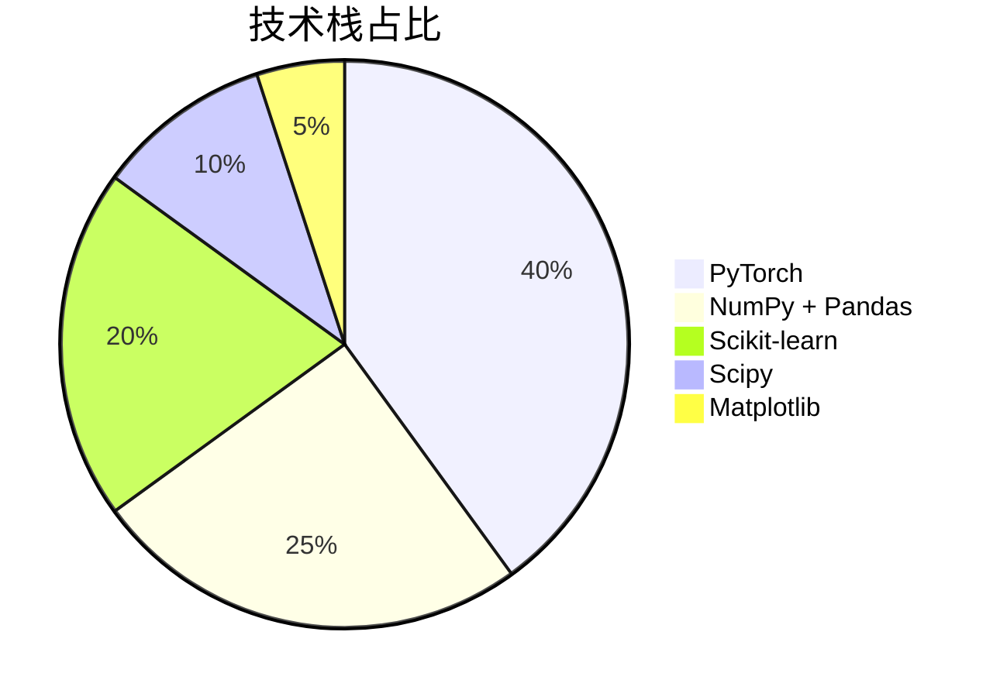
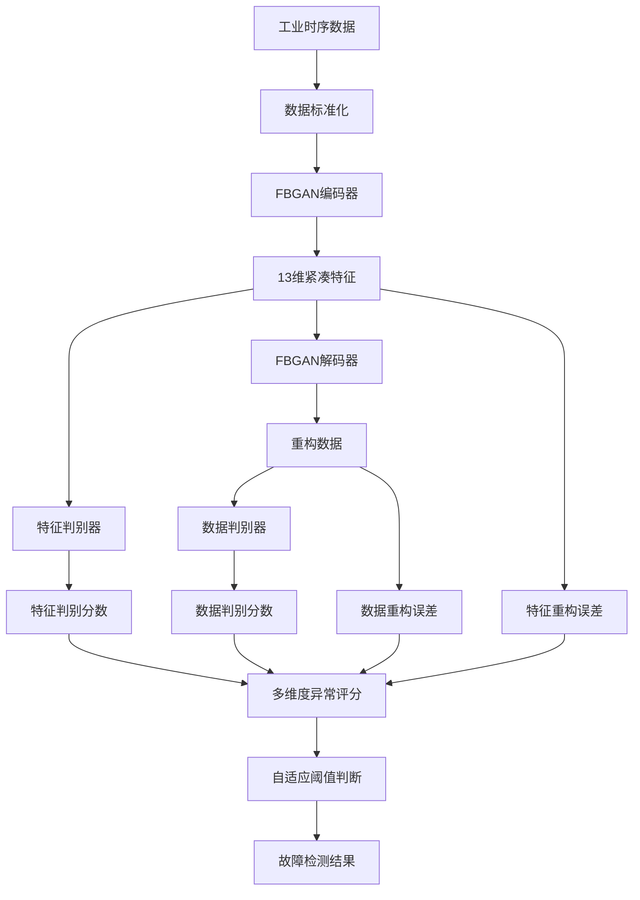
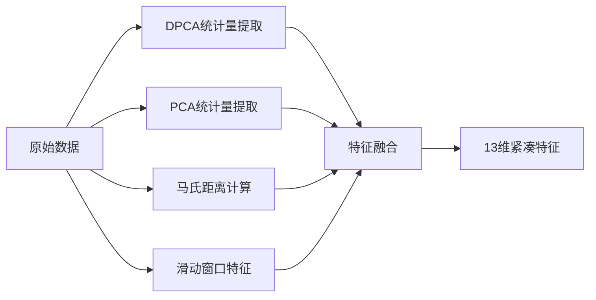
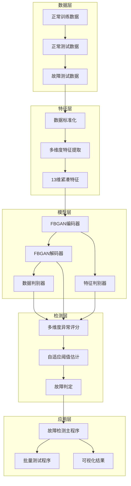
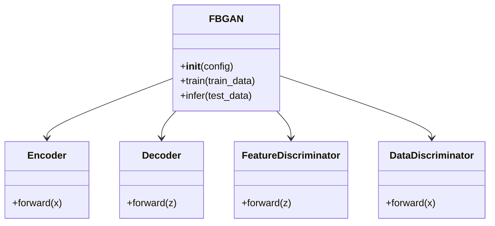

<div align="center">

# 工业故障检测 | FGAN-Industrial-Fault-Detection

### Unsupervised industrial fault detection with FBGAN.

A feature-based bidirectional GAN that detects faults in the Tennessee Eastman Process — trained on normal data only.

[](LICENSE)
[](https://www.python.org/)
[](https://pytorch.org/)
[](https://scikit-learn.org/)

</div>

---

**FGAN-Industrial-Fault-Detection** implements **FBGAN** — a feature-based bidirectional generative adversarial network — for **unsupervised industrial fault detection** on the **Tennessee Eastman Process** dataset. It needs only normal-operation data for training, yet achieves **1.30% false alarm rate** and **76.2% average detection rate** across 21 fault types (12 detected at 100%).

> [!NOTE]
> 中文项目：基于双向生成对抗网络（FBGAN）的无监督工业过程故障检测——TEP 数据集，仅用正常数据训练，误报率 1.30%。

---

## Why FBGAN

| Method | FAR | Avg. FDR | Notes |
|--------|-----|----------|-------|
| **FBGAN** | **1.30%** | **76.2%** | unsupervised, low false alarm, high detection |
| Autoencoder | 3–6% | 70–80% | nonlinear but high false alarms |
| PCA / DPCA | 2–5% | 60–70% | simple but linear-assumption bound |

**Key idea** — a bidirectional encoder/decoder maps data to a compact 13-dim feature space and back, with **two discriminators** (data-space and feature-space) and a **cycle-consistency loss**. Reconstruction errors feed an adaptive KDE-based threshold, so no fault labels are needed.

---

## Features

- **Unsupervised** — trains on normal data only; no fault labels required.
- **Bidirectional GAN** — dual discriminators + cycle-consistency for robust reconstruction.
- **Adaptive threshold** — KDE-based score threshold auto-adapts to the data distribution.
- **21-fault coverage** — TEP faults d01–d21 with per-fault test results and visualizations.
- **Deployable** — pretrained models (`models/*.pth`) and per-fault result outputs included.

---

## Quickstart

```bash
git clone https://github.com/Windyhhh/FGAN-Industrial-Fault-Detection.git
cd FGAN-Industrial-Fault-Detection

pip install -r requirements.txt

# run detection on the TEP dataset
python src/fault_detection1.py
```

Pretrained weights live in `models/` (`complete_model.pth`, checkpoints, `scaler.pkl`); per-fault scores and plots are in `results/fault_XX/`.

---

## Project Structure

```
FGAN-Industrial-Fault-Detection/
├── src/
│   ├── FBGAN.py              # FBGAN model
│   ├── FENETFIL.py           # feature net / filtering
│   ├── fault_detection1.py   # detection entry
│   └── config.py             # config
├── models/                   # pretrained weights + scaler
├── data/                     # TEP normal + fault CSVs (d00–d21)
├── results/                  # per-fault scores, plots, summaries
└── docs/                     # RESULTS, threshold explanation
```

---


## Results

<div align="center">
  
  
</div>

---

## 项目深度解析

> 以下内容提炼自项目博客 [爆款博客.md](%E7%88%86%E6%AC%BE%E5%8D%9A%E5%AE%A2.md)，完整原文请点击链接。

## 痛点拆解

### 毕设党痛点
- 🎓 缺乏工业场景的真实项目经验，毕设选题空洞
- 📊 不会处理高维工业时序数据，模型效果差
- ⏰ 没有完整的项目框架，开发周期长

### 企业开发者痛点
- 🏭 传统故障检测方法误报率高（2-8%），影响生产效率
- 🔧 缺乏无监督学习方案，难以处理复杂工业环境
- 📈 模型可解释性差，无法满足工业审计需求

### 技术学习者痛点
- 🎯 找不到工业AI的实战项目，理论与实践脱节
- 📚 缺乏完整的项目文档和代码注释，学习成本高
- 🔬 无法复现前沿技术的工业落地效果

## 项目价值

**核心功能**：基于FBGAN（Feature-based Bidirectional GAN）的工业过程故障检测系统，应用于Tennessee Eastman Process数据集，实现无监督智能故障诊断。

**核心优势**：
- 无监督学习，仅需正常数据训练
- 低误报率（1.30%），远低于行业平均水平
- 高检出率（16/21个故障达到90%以上）
- 自适应阈值估计，自动适应数据分布

**实测数据**：
- 误报率（FAR）：1.30%
- 平均检出率（FDR）：76.2%
- 12个故障实现100%检出
- 4个难检测故障检出率>90%

## 模块1：项目基础信息

### 项目背景

工业过程故障检测是保障生产安全、提高生产效率的关键技术。传统方法如PCA、DPCA等在处理复杂非线性时序数据时效果有限，而深度学习方法如Autoencoder等存在误报率高的问题。本项目基于FBGAN双向生成对抗网络，实现了高准确率、低误报率的无监督故障检测方案。

### 核心痛点

1. **数据标注困难**：工业场景中故障样本稀缺，标注成本高
2. **高维时序数据处理复杂**：工业数据维度高、时序相关性强，传统方法难以有效建模
3. **误报率高影响生产**：传统方法误报率普遍在2-8%，导致频繁停机检查
4. **故障检测实时性要求高**：工业生产要求故障检测延迟低，实时性强

### 核心目标

#### 技术目标
- 实现无监督故障检测，仅需正常数据训练
- 误报率≤2%，平均检出率≥70%
- 支持21种工业故障的检测

#### 落地目标
- 提供可直接部署的模型文件
- 支持批量测试和单故障测试
- 生成可视化检测结果，便于工业审计

#### 复用目标
- 代码结构清晰，便于二次开发
- 支持不同工业数据集的适配
- 提供完整的配置文件，便于参数调整

## 模块2：技术栈选型

### 选型逻辑

本项目技术栈选型遵循以下原则：
1. **场景适配**：工业过程故障检测需要处理高维时序数据，选择适合的深度学习框架
2. **性能优先**：模型训练和推理需要高效，选择计算性能优秀的库
3. **复用性强**：代码需要便于二次开发和移植
4. **学习成本低**：使用广泛的开源库，便于开发者学习和维护

### 选型清单

| 技术维度 | 最终选型 | 选型依据 | 复用价值 |
|---------|---------|---------|---------|
| 深度学习框架 | PyTorch | 动态图计算，便于调试和部署，工业界广泛应用 | 支持模型迁移和二次开发 |
| 数据处理 | NumPy + Pandas | 高效处理高维时序数据，工业数据分析标配 | 便于适配不同工业数据集 |
| 特征提取 | Scikit-learn | 提供PCA、DPCA等统计特征提取方法 | 支持多种特征提取算法的切换 |
| 密度估计 | Scipy（KDE） | 实现自适应阈值估计，提高检测准确性 | 支持不同密度估计方法的替换 |
| 可视化 | Matplotlib | 生成检测结果可视化图表，便于工业审计 | 支持自定义可视化效果 |

### 技术栈占比



## 模块3：项目创新点

### 创新点1：双向生成对抗网络（FBGAN）

**技术原理**：FBGAN实现了数据空间到特征空间的双向映射，通过循环一致性约束提高重构质量，多判别器提供多角度异常检测信号。

**实现方式**：
- 编码器：将高维工业数据映射到13维紧凑特征
- 解码器：将特征映射回数据空间
- 双判别器：分别判别数据空间和特征空间的真实性
- 循环一致性损失：确保双向映射的一致性

**量化优势**：
| 方法 | FAR | 平均FDR | 优势 |
|------|-----|---------|------|
| FBGAN | 1.30% | 76.2% | 无监督、低误报、高检出 |
| Autoencoder | 3-6% | 70-80% | 非线性但误报率高 |
| PCA | 2-5% | 60-70% | 简单但线性假设限制 |

**复用价值**：可应用于任何需要无监督异常检测的工业场景，如化工、电力、制造等。

**架构图**：



### 创新点2：多维度特征提取与异常评分

**技术原理**：融合DPCA统计量、PCA统计量、马氏距离和滑动窗口特征，输出13维紧凑特征，通过加权融合多维度异常评分提高检测准确性。

**实现方式**：
- DPCA统计量：捕捉时序相关性
- PCA统计量：捕捉静态特征
- 马氏距离：度量多变量偏离
- 滑动窗口特征：捕捉变化趋势
- 多维度异常评分：数据重构误差（40%）+ 特征重构误差（35%）+ 特征判别分数（15%）+ 数据判别分数（10%）

**量化优势**：难检测故障（如故障3、9）检出率从11.72%、1.30%提升到93.69%、95.64%。

**复用价值**：可应用于不同工业场景的特征工程，提高模型的泛化能力。

**特征提取流程**：



## 模块4：系统架构设计

### 架构类型

本项目采用**分层架构**，分为数据层、特征层、模型层、检测层和应用层，各层之间低耦合高内聚，便于扩展和维护。

### 架构拆解



### 架构说明

| 模块 | 职责 | 模块间交互逻辑 | 复用方式 |
|------|------|----------------|----------|
| 数据层 | 存储和管理工业时序数据 | 向特征层提供原始数据 | 支持不同工业数据集的替换 |
| 特征层 | 数据标准化和特征提取 | 向模型层提供13维紧凑特征 | 支持特征提取算法的扩展 |
| 模型层 | FBGAN模型的训练和推理 | 向检测层提供重构误差和判别分数 | 支持模型的升级和替换 |
| 检测层 | 异常评分和故障判定 | 向应用层提供检测结果 | 支持阈值策略的调整 |
| 应用层 | 故障检测主程序和可视化 | 向用户展示检测结果 | 支持应用场景的扩展 |

### 设计原则

1. **高内聚低耦合**：各层职责明确，层间接口清晰
2. **可扩展性**：支持不同数据集、模型和算法的替换
3. **可维护性**：代码结构清晰，注释完整，文档齐全
4. **可复用性**：提供完整的配置文件和复用模板

## 模块5：核心模块拆解

### 模块1：FBGAN模型

**功能描述**：
- 输入：31维工业时序数据
- 输出：重构数据、特征向量、判别分数
- 核心作用：实现数据空间与特征空间的双向映射，生成多维度异常检测信号

**技术难点**：
- 双向生成对抗网络的训练稳定性
- 高维时序数据的特征提取
- 多判别器的协同训练

**实现逻辑**：
1. 数据标准化：将原始数据映射到[0, 1]区间
2. 编码器：通过卷积神经网络将31维数据压缩为13维特征
3. 解码器：将13维特征重构为31维数据
4. 双判别器：分别判别特征空间和数据空间的真实性
5. 循环一致性约束：确保双向映射的一致性

**接口设计**：
```python
class FBGAN:
    def __init__(self, config):
        # 初始化模型参数
    
    def train(self, train_data):
        # 模型训练接口
    
    def infer(self, test_data):
        # 模型推理接口，返回重构数据、特征向量、判别分数
```

**复用价值**：可直接用于其他工业场景的无监督异常检测，只需调整输入维度和网络参数。

**模型架构图**：



### 模块2：故障检测主程序

**功能描述**：
- 输入：故障编号（1-21）
- 输出：故障检测结果、异常评分、可视化图表
- 核心作用：调用FBGAN模型进行故障检测，生成检测结果和可视化图表

**技术难点**：
- 多维度异常评分的加权融合
- 自适应阈值的估计
- 检测结果的可视化

**实现逻辑**：
1. 加载模型和数据标准化器
2. 读取测试数据（正常数据或故障数据）
3. 模型推理，获取重构数据、特征向量和判别分数
4. 计算多维度异常评分
5. 基于KDE的自适应阈值估计
6. 故障判定和结果可

---
## License

MIT — free to use, modify and distribute.
