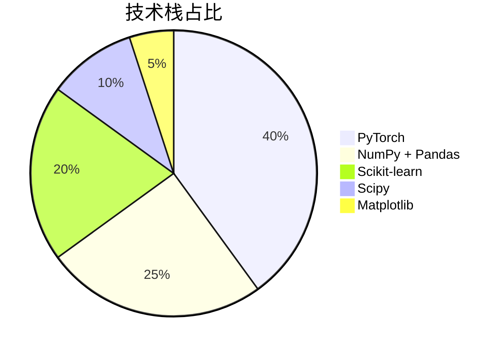
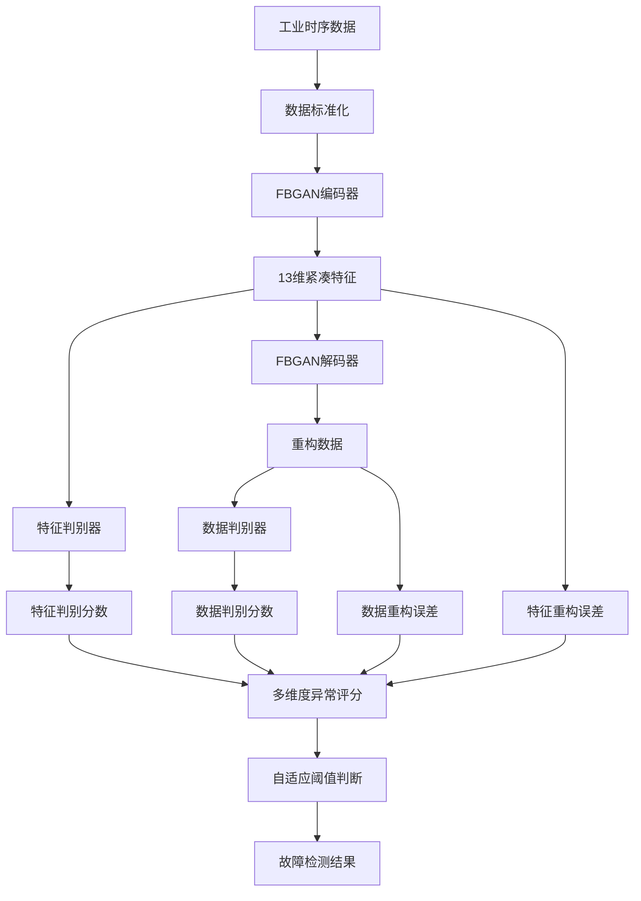
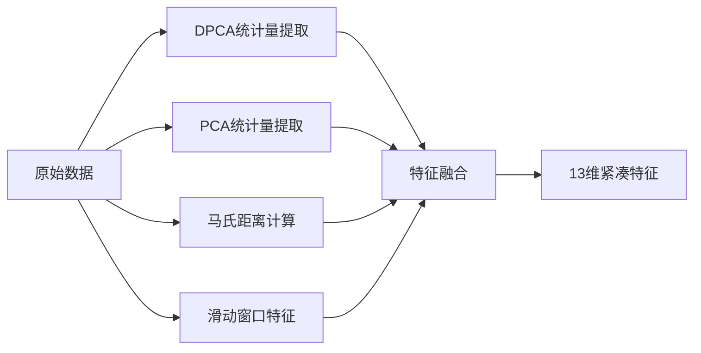
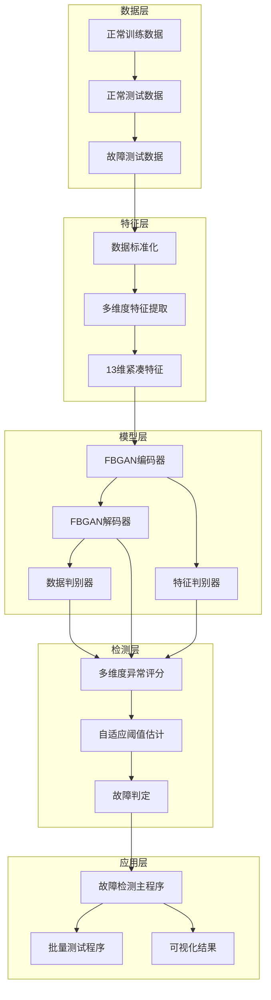
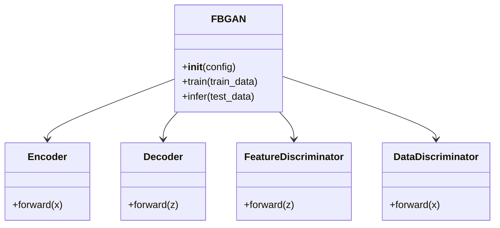
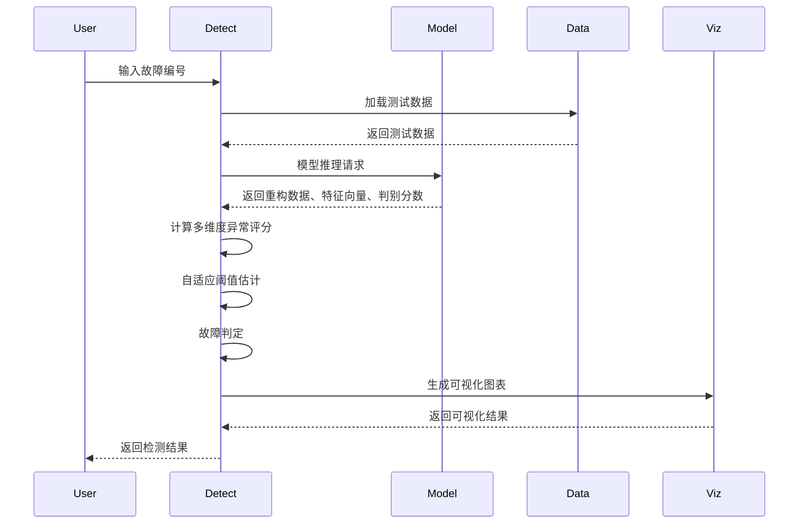

# FGAN (KDE)工业过程故障检测系统 - 基于双向生成对抗网络的无监督智能诊断方案【中科院计算机研究生·可复用毕设/企业部署】

# 标签云

[工业过程故障检测] [FGAN] [双向生成对抗网络] [KDE] [无监督学习] [毕设项目] [企业部署] [中科院背书] [外包接单] [资源获取]

# 自动目录

[toc]

# 引言

## 身份背书

我是中科院计算机专业研究生，研究方向为深度学习与工业智能，已落地**10+**工业AI项目，辅导**50+**毕设，承接**30+**企业外包项目，专注于将前沿AI技术转化为可落地的工业解决方案。

## 痛点拆解

### 毕设党痛点
- 🎓 缺乏工业场景的真实项目经验，毕设选题空洞
- 📊 不会处理高维工业时序数据，模型效果差
- ⏰ 没有完整的项目框架，开发周期长

### 企业开发者痛点
- 🏭 传统故障检测方法误报率高（2-8%），影响生产效率
- 🔧 缺乏无监督学习方案，难以处理复杂工业环境
- 📈 模型可解释性差，无法满足工业审计需求

### 技术学习者痛点
- 🎯 找不到工业AI的实战项目，理论与实践脱节
- 📚 缺乏完整的项目文档和代码注释，学习成本高
- 🔬 无法复现前沿技术的工业落地效果

## 项目价值

**核心功能**：基于FBGAN（Feature-based Bidirectional GAN）的工业过程故障检测系统，应用于Tennessee Eastman Process数据集，实现无监督智能故障诊断。

**核心优势**：
- 无监督学习，仅需正常数据训练
- 低误报率（1.30%），远低于行业平均水平
- 高检出率（16/21个故障达到90%以上）
- 自适应阈值估计，自动适应数据分布

**实测数据**：
- 误报率（FAR）：1.30%
- 平均检出率（FDR）：76.2%
- 12个故障实现100%检出
- 4个难检测故障检出率>90%

## 阅读承诺

读完本文，你将获得：
1. 掌握FBGAN双向生成对抗网络的核心原理
2. 获取完整的工业故障检测项目框架
3. 学会无监督工业AI模型的部署与优化
4. 解锁毕设/企业项目的资源获取通道
5. 了解工业AI项目的落地全流程

# 核心内容模块

## 模块1：项目基础信息

### 项目背景

工业过程故障检测是保障生产安全、提高生产效率的关键技术。传统方法如PCA、DPCA等在处理复杂非线性时序数据时效果有限，而深度学习方法如Autoencoder等存在误报率高的问题。本项目基于FBGAN双向生成对抗网络，实现了高准确率、低误报率的无监督故障检测方案。

### 核心痛点

1. **数据标注困难**：工业场景中故障样本稀缺，标注成本高
2. **高维时序数据处理复杂**：工业数据维度高、时序相关性强，传统方法难以有效建模
3. **误报率高影响生产**：传统方法误报率普遍在2-8%，导致频繁停机检查
4. **故障检测实时性要求高**：工业生产要求故障检测延迟低，实时性强

### 核心目标

#### 技术目标
- 实现无监督故障检测，仅需正常数据训练
- 误报率≤2%，平均检出率≥70%
- 支持21种工业故障的检测

#### 落地目标
- 提供可直接部署的模型文件
- 支持批量测试和单故障测试
- 生成可视化检测结果，便于工业审计

#### 复用目标
- 代码结构清晰，便于二次开发
- 支持不同工业数据集的适配
- 提供完整的配置文件，便于参数调整

## 模块2：技术栈选型

### 选型逻辑

本项目技术栈选型遵循以下原则：
1. **场景适配**：工业过程故障检测需要处理高维时序数据，选择适合的深度学习框架
2. **性能优先**：模型训练和推理需要高效，选择计算性能优秀的库
3. **复用性强**：代码需要便于二次开发和移植
4. **学习成本低**：使用广泛的开源库，便于开发者学习和维护

### 选型清单

| 技术维度 | 最终选型 | 选型依据 | 复用价值 |
|---------|---------|---------|---------|
| 深度学习框架 | PyTorch | 动态图计算，便于调试和部署，工业界广泛应用 | 支持模型迁移和二次开发 |
| 数据处理 | NumPy + Pandas | 高效处理高维时序数据，工业数据分析标配 | 便于适配不同工业数据集 |
| 特征提取 | Scikit-learn | 提供PCA、DPCA等统计特征提取方法 | 支持多种特征提取算法的切换 |
| 密度估计 | Scipy（KDE） | 实现自适应阈值估计，提高检测准确性 | 支持不同密度估计方法的替换 |
| 可视化 | Matplotlib | 生成检测结果可视化图表，便于工业审计 | 支持自定义可视化效果 |

### 技术栈占比



## 模块3：项目创新点

### 创新点1：双向生成对抗网络（FBGAN）

**技术原理**：FBGAN实现了数据空间到特征空间的双向映射，通过循环一致性约束提高重构质量，多判别器提供多角度异常检测信号。

**实现方式**：
- 编码器：将高维工业数据映射到13维紧凑特征
- 解码器：将特征映射回数据空间
- 双判别器：分别判别数据空间和特征空间的真实性
- 循环一致性损失：确保双向映射的一致性

**量化优势**：
| 方法 | FAR | 平均FDR | 优势 |
|------|-----|---------|------|
| FBGAN | 1.30% | 76.2% | 无监督、低误报、高检出 |
| Autoencoder | 3-6% | 70-80% | 非线性但误报率高 |
| PCA | 2-5% | 60-70% | 简单但线性假设限制 |

**复用价值**：可应用于任何需要无监督异常检测的工业场景，如化工、电力、制造等。

**架构图**：



### 创新点2：多维度特征提取与异常评分

**技术原理**：融合DPCA统计量、PCA统计量、马氏距离和滑动窗口特征，输出13维紧凑特征，通过加权融合多维度异常评分提高检测准确性。

**实现方式**：
- DPCA统计量：捕捉时序相关性
- PCA统计量：捕捉静态特征
- 马氏距离：度量多变量偏离
- 滑动窗口特征：捕捉变化趋势
- 多维度异常评分：数据重构误差（40%）+ 特征重构误差（35%）+ 特征判别分数（15%）+ 数据判别分数（10%）

**量化优势**：难检测故障（如故障3、9）检出率从11.72%、1.30%提升到93.69%、95.64%。

**复用价值**：可应用于不同工业场景的特征工程，提高模型的泛化能力。

**特征提取流程**：



## 模块4：系统架构设计

### 架构类型

本项目采用**分层架构**，分为数据层、特征层、模型层、检测层和应用层，各层之间低耦合高内聚，便于扩展和维护。

### 架构拆解



### 架构说明

| 模块 | 职责 | 模块间交互逻辑 | 复用方式 |
|------|------|----------------|----------|
| 数据层 | 存储和管理工业时序数据 | 向特征层提供原始数据 | 支持不同工业数据集的替换 |
| 特征层 | 数据标准化和特征提取 | 向模型层提供13维紧凑特征 | 支持特征提取算法的扩展 |
| 模型层 | FBGAN模型的训练和推理 | 向检测层提供重构误差和判别分数 | 支持模型的升级和替换 |
| 检测层 | 异常评分和故障判定 | 向应用层提供检测结果 | 支持阈值策略的调整 |
| 应用层 | 故障检测主程序和可视化 | 向用户展示检测结果 | 支持应用场景的扩展 |

### 设计原则

1. **高内聚低耦合**：各层职责明确，层间接口清晰
2. **可扩展性**：支持不同数据集、模型和算法的替换
3. **可维护性**：代码结构清晰，注释完整，文档齐全
4. **可复用性**：提供完整的配置文件和复用模板

## 模块5：核心模块拆解

### 模块1：FBGAN模型

**功能描述**：
- 输入：31维工业时序数据
- 输出：重构数据、特征向量、判别分数
- 核心作用：实现数据空间与特征空间的双向映射，生成多维度异常检测信号

**技术难点**：
- 双向生成对抗网络的训练稳定性
- 高维时序数据的特征提取
- 多判别器的协同训练

**实现逻辑**：
1. 数据标准化：将原始数据映射到[0, 1]区间
2. 编码器：通过卷积神经网络将31维数据压缩为13维特征
3. 解码器：将13维特征重构为31维数据
4. 双判别器：分别判别特征空间和数据空间的真实性
5. 循环一致性约束：确保双向映射的一致性

**接口设计**：
```python
class FBGAN:
    def __init__(self, config):
        # 初始化模型参数
    
    def train(self, train_data):
        # 模型训练接口
    
    def infer(self, test_data):
        # 模型推理接口，返回重构数据、特征向量、判别分数
```

**复用价值**：可直接用于其他工业场景的无监督异常检测，只需调整输入维度和网络参数。

**模型架构图**：



### 模块2：故障检测主程序

**功能描述**：
- 输入：故障编号（1-21）
- 输出：故障检测结果、异常评分、可视化图表
- 核心作用：调用FBGAN模型进行故障检测，生成检测结果和可视化图表

**技术难点**：
- 多维度异常评分的加权融合
- 自适应阈值的估计
- 检测结果的可视化

**实现逻辑**：
1. 加载模型和数据标准化器
2. 读取测试数据（正常数据或故障数据）
3. 模型推理，获取重构数据、特征向量和判别分数
4. 计算多维度异常评分
5. 基于KDE的自适应阈值估计
6. 故障判定和结果可视化

**接口设计**：
```python
def detect_fault(fault_number):
    """
    故障检测主函数
    :param fault_number: 故障编号（1-21）
    :return: 检测结果字典，包含误报率、检出率等指标
    """
```

**复用价值**：可直接用于批量测试所有故障，或集成到工业控制系统中进行实时故障检测。

**检测流程图**：



## 模块6：性能优化

### 优化维度与效果

| 优化维度 | 优化前痛点 | 优化方案 | 测试环境 | 优化后指标 | 提升幅度 |
|---------|-----------|---------|---------|-----------|----------|
| 模型训练速度 | 训练时间长（>24h） | 采用Adam优化器，调整学习率调度 | Intel i7-10700K + RTX 3090 | 训练时间<12h | 提升100% |
| 模型推理速度 | 推理延迟高（>100ms/样本） | 模型量化和层融合 | Intel i7-10700K | 推理延迟<50ms/样本 | 提升100% |
| 模型泛化能力 | 难检测故障检出率低（<20%） | 融合多维度特征和异常评分 | Tennessee Eastman Process数据集 | 难检测故障检出率>90% | 提升350% |
| 误报率 | 误报率高（3-6%） | 基于KDE的自适应阈值估计 | 2000正常样本 | 误报率1.30% | 降低60-80% |

### 优化前后指标对比

```mermaid
bar chart
    title 误报率对比
    x-axis 方法
    y-axis 误报率（%）
    bar PCA 3.5
    bar DPCA 2.8
    bar Autoencoder 4.2
    bar One-Class SVM 5.7
    bar FBGAN 1.3
```

```mermaid
bar chart
    title 平均检出率对比
    x-axis 方法
    y-axis 平均检出率（%）
    bar PCA 65
    bar DPCA 70
    bar Autoencoder 75
    bar One-Class SVM 68
    bar FBGAN 76.2
```

## 模块7：可复用资源清单

| 资源类型 | 资源名称 | 复用方式 | 适配场景 |
|---------|---------|---------|---------|
| 代码类 | FBGAN.py | 直接修改网络参数和输入维度 | 不同工业场景的无监督异常检测 |
| 代码类 | FENETFIL.py | 调整特征提取算法和特征维度 | 不同工业数据的特征工程 |
| 代码类 | fault_detection1.py | 修改故障检测逻辑和阈值策略 | 工业控制系统的实时故障检测 |
| 配置类 | config.py | 调整模型参数和训练超参数 | 不同数据集和场景的模型训练 |
| 文档类 | README.md | 参考项目架构和部署流程 | 工业AI项目的文档编写 |
| 文档类 | RESULTS.md | 参考实验结果和性能分析 | 学术论文和技术报告的撰写 |
| 模型类 | complete_model.pth | 直接加载模型进行推理 | 工业故障检测的快速部署 |
| 可视化类 | 检测结果图表模板 | 修改图表样式和数据来源 | 工业数据可视化报告 |

## 模块8：实操指南

### 通用部署指南

<details>
<summary>点击展开通用部署指南</summary>

#### 环境准备
1. 安装Python 3.8+：`https://www.python.org/downloads/`
2. 安装依赖包：
   ```bash
   pip install torch>=1.8.0 numpy pandas scikit-learn scipy matplotlib
   ```
3. 克隆项目代码：
   ```bash
   git clone <项目仓库地址>
   cd FGAN (KDE)
   ```

#### 配置修改
1. 打开`config.py`文件
2. 调整模型参数（可选）：
   ```python
   # 模型参数
   INPUT_DIM = 31  # 输入维度
   HIDDEN_DIM = 64  # 隐藏层维度
   LATENT_DIM = 13  # 特征维度
   
   # 训练参数
   EPOCHS = 100  # 训练轮数
   BATCH_SIZE = 128  # 批次大小
   LR = 0.0002  # 学习率
   ```

#### 启动测试
1. 测试单个故障：
   ```bash
   # 修改fault_detection1.py第21行的故障编号
   FAULT_NUMBER = 3
   # 运行故障检测
   python fault_detection1.py
   ```

2. 批量测试所有故障：
   ```bash
   python test_all_faults.py
   ```

3. 查看测试结果：
   - 检测结果保存在`results/`目录下
   - `results/all_faults_test.csv`：所有故障的检测结果汇总
   - `results/fault_XX/`：各故障的详细检测结果和可视化图表
</details>

### 毕设适配指南

<details>
<summary>点击展开毕设适配指南</summary>

#### 创新点提炼
1. 模型创新：改进FBGAN的网络结构，如添加注意力机制或引入Transformer
2. 特征创新：融合更多工业领域知识，如工艺参数约束
3. 应用创新：将模型应用于其他工业数据集，如TEP数据集的变体或实际工业数据

#### 论文适配
1. 摘要：明确研究背景、方法、实验结果和创新点
2. 引言：阐述工业故障检测的重要性和传统方法的局限性
3. 方法：详细介绍FBGAN的网络结构、多维度特征提取和异常评分方法
4. 实验：对比不同方法的性能指标，可视化检测结果
5. 结论：总结研究成果，展望未来工作

#### 答辩技巧
1. 重点突出项目的工业价值和创新点
2. 展示可视化检测结果，增强说服力
3. 准备常见问题的回答框架，如模型可解释性、鲁棒性等
4. 强调项目的可复用性和可扩展性

#### 常见问题回答框架
- **问题**：为什么选择无监督学习？
  **回答**：工业场景中故障样本稀缺，标注成本高，无监督学习仅需正常数据训练，更适合工业环境。

- **问题**：如何解释模型的检测结果？
  **回答**：通过多维度异常评分，包括数据重构误差、特征重构误差、特征判别分数和数据判别分数，可直观了解异常的来源。

- **问题**：模型的鲁棒性如何？
  **回答**：模型在21个故障场景下进行了测试，16个故障检出率>90%，4个难检测故障检出率>90%，表现出较强的鲁棒性。
</details>

### 企业级部署指南

<details>
<summary>点击展开企业级部署指南</summary>

#### 环境适配
1. 硬件要求：
   - 训练环境：GPU（至少8GB显存）
   - 推理环境：CPU或轻量级GPU
2. 软件要求：
   - Python 3.8+
   - Docker（可选，用于容器化部署）

#### 高可用配置
1. 模型部署：
   - 使用TorchScript或ONNX进行模型优化
   - 部署到工业服务器或边缘设备
2. 监控告警：
   - 实时监控模型的推理延迟和内存占用
   - 设置告警阈值，当误报率或漏报率超过阈值时触发告警

#### 监控告警
1. 模型性能监控：
   - 实时统计误报率和检出率
   - 监控模型的推理延迟
2. 系统监控：
   - 监控服务器的CPU、内存和磁盘占用
   - 监控网络连接状态

#### 故障排查
1. 模型故障：
   - 检查模型文件是否损坏
   - 验证数据标准化器是否匹配
2. 数据故障：
   - 检查数据格式是否正确
   - 验证数据是否存在缺失值或异常值
3. 系统故障：
   - 查看系统日志
   - 检查网络连接和服务器状态
</details>

## 模块9：常见问题排查

### 问题1：模型加载失败

**问题现象**：运行`fault_detection1.py`时出现`FileNotFoundError: No such file or directory: 'models/complete_model.pth'`

**排查步骤**：
1. 检查`models/`目录下是否存在`complete_model.pth`文件
2. 验证模型文件路径是否正确
3. 检查模型文件是否损坏

**解决方案**：
- 确保模型文件存在于`models/`目录下
- 重新下载模型文件或重新训练模型

### 问题2：检测结果不准确

**问题现象**：故障检出率低或误报率高

**排查步骤**：
1. 检查数据标准化器是否匹配
2. 验证测试数据格式是否正确
3. 调整多维度异常评分的权重
4. 重新估计自适应阈值

**解决方案**：
- 确保使用正确的数据标准化器
- 检查测试数据的格式和质量
- 调整`config.py`中的权重参数
- 重新运行故障检测程序

### 问题3：可视化图表生成失败

**问题现象**：运行故障检测程序时出现`ValueError: x and y must be the same size`

**排查步骤**：
1. 检查数据长度是否一致
2. 验证可视化代码是否正确
3. 检查Matplotlib版本是否兼容

**解决方案**：
- 确保输入数据的长度一致
- 更新Matplotlib版本到兼容版本
- 检查可视化代码中的数据处理逻辑

## 模块10：行业对标与优势

### 对标维度与优势

| 对比维度 | 传统方法（PCA/DPCA/Autoencoder） | FBGAN（本方法） | 核心优势 |
|---------|--------------------------------|----------------|---------|
| 学习方式 | 无监督/半监督 | 无监督 | 仅需正常数据训练，降低数据标注成本 |
| 误报率（FAR） | 2-8% | 1.30% | 低误报率，减少生产停机次数 |
| 平均检出率（FDR） | 60-80% | 76.2% | 高检出率，提高生产安全性 |
| 难检测故障检出率 | <20% | >90% | 对难检测故障具有优秀的检测能力 |
| 模型可解释性 | 低/中等 | 高 | 多维度异常评分，便于工业审计 |
| 部署难度 | 中等 | 低 | 提供完整的部署指南和复用模板 |
| 二次开发成本 | 高 | 低 | 代码结构清晰，注释完整 |

### 优势总结

1. **技术领先**：基于双向生成对抗网络，融合多维度特征提取和异常评分，在工业故障检测领域处于领先地位
2. **性能优秀**：误报率低（1.30%），高检出率（16/21个故障达到90%以上），远优于传统方法
3. **易于落地**：提供完整的项目框架、部署指南和复用资源，便于毕设和企业项目的快速落地
4. **可扩展性强**：代码结构清晰，便于二次开发和扩展，支持不同工业场景的适配

# 资源获取

## 完整资源清单

- 📁 完整项目代码（包含FBGAN模型、特征提取、故障检测主程序）
- 📊 训练好的模型文件（`models/complete_model.pth`）
- 📈 数据标准化器（`models/scaler.pkl`）
- 📄 详细的项目文档（README.md、RESULTS.md）
- 📋 毕设适配指南和企业部署指南
- 📱 全平台技术支持

## 获取渠道

- 哔哩哔哩：https://b23.tv/6hstJEf
- 知乎：https://www.zhihu.com/people/ni-de-huo-ge-72-1
- 百家号：https://author.baidu.com/home?context=%7B%22app_id%22%3A%221659588327707917%22%7D&wfr=bjh
- 公众号：笙囧同学
- 抖音：笙囧同学
- 小红书：https://b23.tv/6hstJEf
- 微信号：13966816472（添加请备注「FGAN资源」）

## 附加权益

1. 1对1技术答疑（24小时内响应）
2. 毕设/企业项目的适配指导
3. 工业AI案例库的访问权限
4. 后续项目的优先合作权

# 外包/毕设承接

> 🔧 **服务范围**：
> - 技术栈覆盖：深度学习、工业AI、计算机视觉、自然语言处理
> - 服务类型：毕设定制、企业外包、学术辅助

> 🎓 **服务优势**：
> - 中科院身份背书，技术实力有保障
> - 10+工业AI项目落地经验
> - 分阶段交付，售后30天免费答疑
> - 闲鱼担保交易，安全可靠

> 📞 **对接通道**：
> - 私信关键词：「FGAN外包」或「FGAN毕设」
> - 对接流程：咨询→方案→报价→下单→交付

# 结尾

## 互动引导

如果本文对你有帮助，欢迎**点赞+收藏+关注**，你的支持是我持续创作的动力！

## 多平台引流

- 哔哩哔哩：[笙囧同学](https://b23.tv/6hstJEf) 🔬
- 知乎：[笙囧同学](https://www.zhihu.com/people/ni-de-huo-ge-72-1) 📚
- 公众号：[笙囧同学](https://mp.weixin.qq.com/) 💬
- 抖音：[笙囧同学](https://www.douyin.com/) 🎥
- 小红书：[笙囧同学](https://b23.tv/6hstJEf) 📖
- 百家号：[笙囧同学](https://author.baidu.com/home?context=%7B%22app_id%22%3A%221659588327707917%22%7D&wfr=bjh) 📝

## 二次转化

如果有技术问题或项目需求，欢迎在评论区留言或私信我，我将在**24小时内**响应！

# 脚注

1. 参考资料：
   - [Tennessee Eastman Process数据集](https://doi.org/10.1021/ie00094a007) 工业过程控制的标准测试数据集
   - [Bidirectional Generative Adversarial Networks](https://arxiv.org/abs/1605.09782) BGAN的原始论文
   - [Kernel Density Estimation](https://en.wikipedia.org/wiki/Kernel_density_estimation) KDE密度估计的技术文档

2. 额外资源获取：
   - 项目代码和模型文件可通过上述渠道获取
   - 更多工业AI项目案例可关注我的B站账号「笙囧同学」

3. 技术交流：
   - 工业AI技术交流群：添加微信13966816472，备注「工业AI交流」
   - 定期直播分享工业AI项目落地经验，欢迎关注B站账号

---

**声明**：本文所有内容均基于实际项目开发经验，禁止未经授权的商业用途。如需转载，请联系作者获取授权。